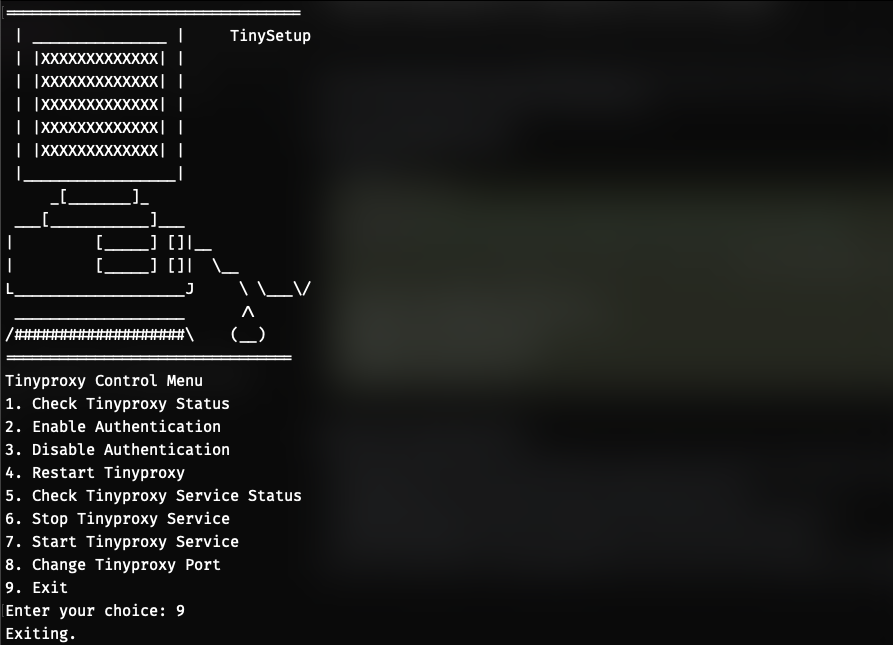

# Tinyproxy Control



[](LICENSE)

A Bash script to easily manage and configure Tinyproxy. This tool provides a user-friendly menu to control various aspects of Tinyproxy, including:

- Starting and stopping the service.
- Enabling and disabling authentication.
- Changing the listening port.
- Checking the service status.
- Scanning the proxy port.

## Features

- **Menu-driven interface:** Easy to use for both beginners and experienced users.
- **Authentication control:** Enable or disable basic authentication with a single command.
- **Port management:** Change the Tinyproxy listening port and automatically scan it for availability.
- **Service management:** Start, stop, and restart the Tinyproxy service with ease.
- **Status checks:** Quickly check the service status and port availability.
- **Informative output:** Clear and concise messages to guide the user through operations.
- **VPS security reminder:** Reminds users to update inbound network security rules when the port is changed.

## Installation

1. **Clone the repository:**

    ```bash
    git clone https://github.com/0x1Jar/Tinyproxy-Control.git
    cd Tinyproxy-Control
    ```

2. **Make the script executable:**

    ```bash
    chmod +x SetTinyProxy.sh
    ```

3. **Run the script:**

    ```bash
    sudo ./SetTinyProxy.sh
    ```

## Usage

Once the script is running, you'll be presented with a menu. Follow the prompts to perform the desired actions. Each option is clearly labeled, making it easy to navigate.

## Configuration

- The script modifies the Tinyproxy configuration file located at `/etc/tinyproxy/tinyproxy.conf`.
- Authentication credentials are set within the script. You can change the default username and password directly in the script.

## Images

- Screenshots and other images related to this project can be stored in the `images` folder. Feel free to add your own images for reference.

## Contributing

Contributions are welcome! If you find a bug or have a suggestion, please open an issue or submit a pull request. Your feedback helps improve the tool for everyone.

## License

This project is licensed under the MIT License. See the `LICENSE` file for details.